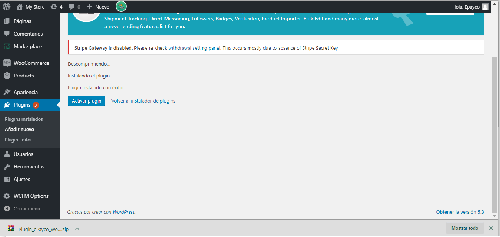
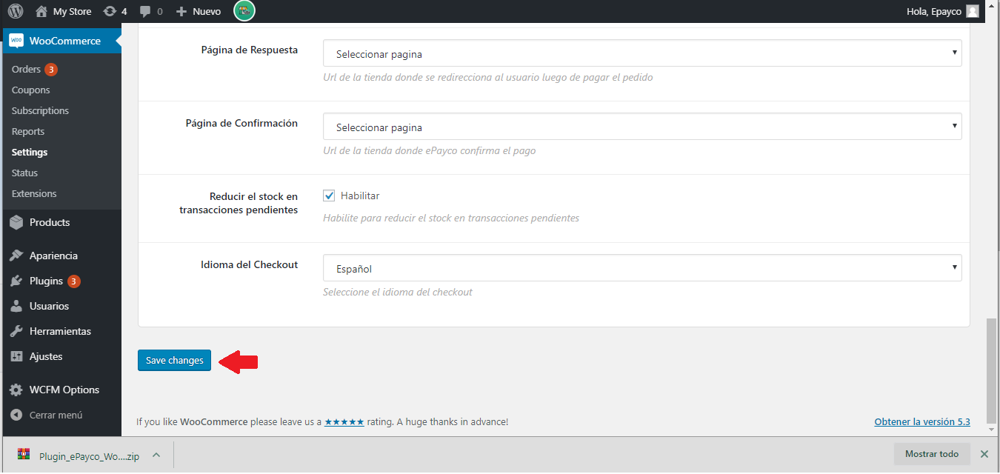
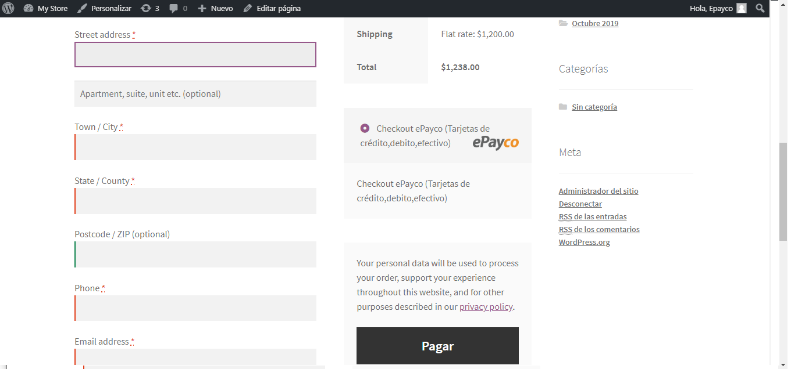

# ePayco plugin para WooCommerce v2.6 o superior

**Si usted tiene alguna pregunta o problema, no dude en ponerse en contacto con nuestro soporte técnico: desarrollo@payco.co.**

## Versiones

| Versión | URL de repositorio | Versión compatible con Woocommerce | ¿Incluye soporte de ePayco? |
| :---:   | :---:     | :---:    | :---:    |
| 8.0.4   | [ePayco plugin WooCommerce v8.0.4](https://github.com/epayco/plugin-woocommerce-agregador/releases/tag/v8.0.4)     | 8.0.0 o superior   |  |
| 8.0.3   | [ePayco plugin WooCommerce v8.0.3](https://github.com/epayco/plugin-woocommerce-agregador/releases/tag/v8.0.3)     | 8.0.0 o superior   |  |
| 8.0.2   | [ePayco plugin WooCommerce v8.0.2](https://github.com/epayco/plugin-woocommerce-agregador/releases/tag/v8.0.2)     | 8.0.0 o superior   |  |
| 8.0.1   | [ePayco plugin WooCommerce v8.0.1](https://github.com/epayco/plugin-woocommerce-agregador/releases/tag/v8.0.1)     | 8.0.0 o superior   |  |
| 8.0.0   | [ePayco plugin WooCommerce v8.0.0](https://github.com/epayco/plugin-woocommerce-agregador/releases/tag/v8.0.0)     | 8.0.0 o superior   |  |
| 7.2.0   | [ePayco plugin WooCommerce v7.2.0](https://github.com/epayco/plugin-woocommerce-agregador/releases/tag/v7.2.0)     | 7.0.0 o superior   |  |
| 7.1.0   | [ePayco plugin WooCommerce v7.1.0](https://github.com/epayco/plugin-woocommerce-agregador/releases/tag/v7.1.0)     | 7.0.0 o superior   |  |
| 7.0.0   | [ePayco plugin WooCommerce v7.0.0](https://github.com/epayco/plugin-woocommerce-agregador/releases/tag/v7.0.0)     | 6.6.0 o superior   |  |
| 6.7.4   | [ePayco plugin WooCommerce v6.7.4](https://github.com/epayco/plugin-woocommerce-agregador/releases/tag/v6.7.4)     | 6.6.0 o superior   |  |
| 6.7.1   | [ePayco plugin WooCommerce v6.7.1](https://github.com/epayco/plugin-woocommerce-agregador/releases/tag/v6.7.1)     | 6.6.0 o superior   |  |
| 6.7.0   | [ePayco plugin WooCommerce v6.7.0](https://github.com/epayco/plugin-woocommerce-agregador/releases/tag/v6.7.0)     | 6.4.0 o superior   |  |

## Tabla de contenido

* [Requisitos](#requisitos)
* [Instalación](#instalación)
* [Pasos](#pasos)
* [Versiones](#versiones)

## Requisitos

* Tener una cuenta activa en [ePayco](https://pagaycobra.com).
* Tener instalado WordPress y WooCommerce.
* Acceso a las carpetas donde está instalado WordPress y WooCommerce.
* Acceso al admin de WordPress.

## Instalación

1. [Descarga el plugin.](https://github.com/epayco/plugin-woocommerce-agregador/releases/tag/v8.0.4)
2. Ingresa al administrador de tu WordPress.
3. Ingresa a Plugins / Añadir-Nuevo / Subir-Plugin.
4. Busca el plugin descargado en tu equipo y súbelo como cualquier otro archivo.
5. Después de instalar el .zip, lo puedes ver en la lista de plugins instalados; puedes activarlo o desactivarlo.
6. Para configurar el plugin debes ir a: WooCommerce / Ajustes / Finalizar Compra y ubicar la pestaña ePayco.
7. Configura el plugin ingresando el **P_CUST_ID_CLIENTE**,**P_KEY**, **PUBLIC_KEY**, **PRIVATE_KEY** los cuales puedes ver en tu [panel de clientes](https://secure.payco.co/clientes/).
8. Selecciona o crea una página de respuesta donde el usuario será devuelto después de finalizar la compra.
9. Realiza una o varias compras para comprobar que todo esté bien.
10. Si todo está correcto, recuerda cambiar la variable Modo Prueba a **NO** y empieza a recibir pagos de forma instantánea y segura con ePayco.
11. Split: en los datos del producto encontrarás la sección de Receivers, donde configuras el **P_CUST_ID** y el valor en porcentaje del producto.

## Pasos

Aquí se incluyen imágenes explicativas para los pasos:

