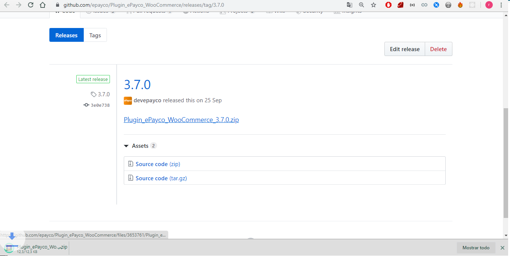
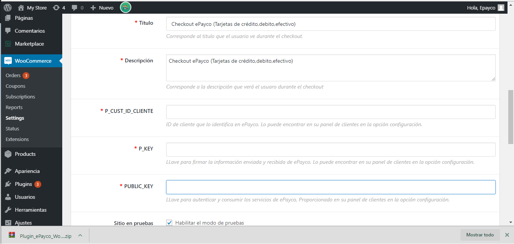

#ePayco plugin para WooCommerce v2.6

**Si usted tiene alguna pregunta o problema, no dude en ponerse en contacto con nuestro soporte técnico: desarrollo@payco.co.**

## Versiones

| Versión | URL de repositorio | Versión compatible con Woocommerce | ¿Incluye soporte de ePayco? |
| :---:   | :---:     | :---:    | :---:    |
| 6.7.2   | [ePayco plugin WooCommerce v6.6.1](https://github.com/epayco/plugin-woocommerce-agregador/releases/tag/v6.7.2)     | 6.0.1 o superior   |     |
| 6.6.1   | [ePayco plugin WooCommerce v6.6.1](https://github.com/epayco/plugin-woocommerce-agregador/releases/tag/v6.6.1)     | 6.0.1 o superior   |     |
| 6.6.0   | [ePayco plugin WooCommerce v6.6.0](https://github.com/epayco/plugin-woocommerce-agregador/releases/tag/v6.6.0)     | 6.0.1 o superior   |     |
| 6.5.0   | [ePayco plugin WooCommerce v6.5.0](https://github.com/epayco/plugin-woocommerce-agregador/releases/tag/V6.5.0)     | 6.0.1 o superior   |     |
| 6.4.0   | [ePayco plugin WooCommerce v6.4.0](https://github.com/epayco/plugin-woocommerce-agregador/releases/tag/V6.4.0)     | 6.0.1 o superior   |     |
| 6.3.0   | [ePayco plugin WooCommerce v6.3.0](https://github.com/epayco/plugin-woocommerce-agregador/releases/tag/V6.3.0)     | 6.0.1 o superior   |     |
| 6.2.0   | [ePayco plugin WooCommerce v6.2.0](https://github.com/epayco/plugin-woocommerce-agregador/releases/tag/V6.2.0)     | 6.0.1 o superior   |     |
| 6.1.0   | [ePayco plugin WooCommerce v6.1.0](https://github.com/epayco/plugin-woocommerce-agregador/releases/tag/V6.1.0)     | 6.0.1 o superior   |     |
| 6.0.0   | [ePayco plugin WooCommerce v6.0.0](https://github.com/epayco/plugin-woocommerce-agregador/releases/tag/V6.0.0)     | 6.0.1 o superior   |     |
| 5.5.0   | [ePayco plugin WooCommerce v5.5.0](https://github.com/epayco/plugin-woocommerce-agregador/releases/tag/V5.5.0)     | 5.5.4 o superior   |     |
| 5.4.0   | [ePayco plugin WooCommerce v5.4.0](https://github.com/epayco/plugin-woocommerce-agregador/releases/tag/V5.4.0)     | 5.4.4 o superior   |     |
| 5.3.0   | [ePayco plugin WooCommerce v5.3.0](https://github.com/epayco/plugin-woocommerce-agregador/releases/tag/V5.3.0)     | 5.0.3 o superior   |     |
| 4.4.x   | [ePayco plugin WooCommerce v4.4.x](https://github.com/epayco/plugin-woocommerce-agregador/releases/tag/V4.4.x)     | 4.3.6 o superior   |     |

## Tabla de contenido

* [Requisitos](#requisitos)
* [Instalación](#instalación)
* [Pasos](#pasos)
* [Versiones](#versiones)

## Requisitos

* Tener una cuenta activa en [ePayco](https://pagaycobra.com).
* Tener instalado WordPress y WooCommerce.
* Acceso a las carpetas donde se encuetra instalado WordPress y WooCommerce.
* Acceso al admin de WordPress.

## Instalación

1. [Descarga el plugin.](https://github.com/epayco/Plugin_ePayco_WooCommerce/releases/tag/3.2.1)
2. Ingresa al administrador de tu wordPress.
3. Ingresa a Plugins / Añadir-Nuevo / Subir-Plugin. 
4. Busca el plugin descargado en tu equipo y súbelo como cualquier otro archivo.
5. Después de instalar el .zip lo puedes ver en la lista de plugins instalados , puedes activarlo o desactivarlo.
6. Para configurar el plugin debes ir a: WooCommerce / Ajustes / Finalizar Compra y Ubica la pestaña ePayco.
7. Configura el plugin ingresando el **P_CUST_ID_CLIENTE** y el **P_KEY**, los puedes ver en tu [panel de clientes](https://secure.payco.co/clientes/).
8. Selecciona o crea una página de respuesta donde el usuario será devuelto después de finalizar la compra.
9. Realiza una o varias compras para comprobar que todo esté bien.
10. Si todo está bien recuerda cambiar la variable Modo Prueba a NO y empieza a recibir pagos de forma instantánea y segura con ePayco.

## Pasos

